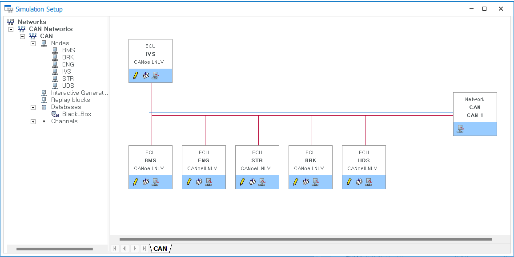
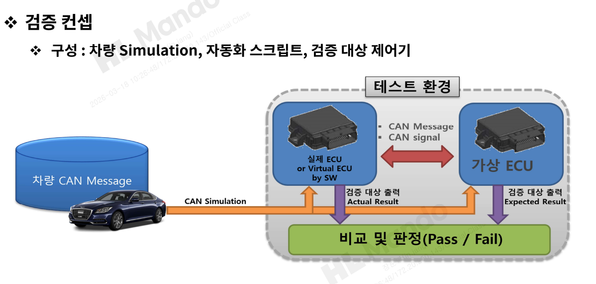
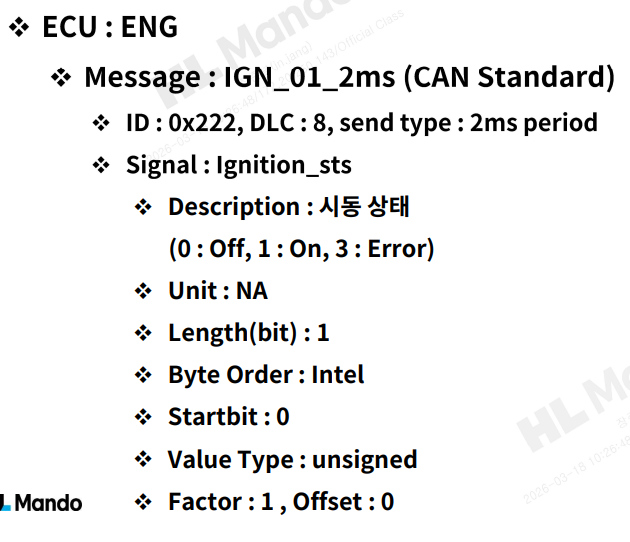

# HL만도 & HL클레무브 IVS Black Box Validation Project

<p align="center">
  
</p>

<p align="center">
  CANoe 기반 환경 구축, CANdb 설계, CAPL 자동화 테스트를 통해<br>
  IVS 제어기의 CAN/UDS 요구사항과 Fault 관리 로직을 검증한 프로젝트
</p>

---

## Overview

이 프로젝트는 **IVS 제어기**를 대상으로 CAN 기반 입력/출력 요구사항, UDS 요청/응답, 그리고 Fault Detection / Recovery / Delete 로직을 검증한 **Black Box Testing 프로젝트**입니다.

CANoe 환경에서 IVS와 주변 ECU를 network node로 구성하고, CANdb를 작성해 메시지를 정의했으며, Panel/Trace 기반 수동 검증과 CAPL 기반 자동화 테스트를 수행했습니다.

---

## Tech Stack

- **Tool**: CANoe
- **Language**: CAPL
- **Database**: CANdb (DBC)
- **Protocol**: CAN, UDS

---

## What I Did

- CANoe 네트워크 및 검증 환경 구축
- IVS 외 ECU node 구성
- CANdb 작성
- Panel / Trace 기반 수동 검증 환경 구성
- CAPL 기반 자동화 테스트 코드 작성
- 요구사항 기반 테스트 케이스 설계
- 정적/동적 테스트 수행 및 결함 분석

---

## Validation Scope

- CAN 입력 메시지 검증
- UDS 요청/응답 검증
- Fault 상태 전이 검증
- IGN 50 Cycle Delete 로직 검증
- 경계값 / 타이밍 조건 검증

---

## Test Environment

<p align="center">
  
</p>

- **Network Setup**: IVS, BMS, ENG, STR, BRK, UDS ECU 구성
- **Manual Validation**: Panel을 통한 입력 제어, Trace를 통한 메시지 확인
- **Automated Validation**: CAPL 기반 반복 테스트 자동화

<p align="center">
  
</p>

---

## Representative Testing & Defects

본 프로젝트에서는 요구사항 문서와 메시지 정의를 검토하는 **정적 테스팅**과,
실제 입력 조건을 구성해 동작을 검증하는 **동적 테스팅**을 함께 수행했습니다.
이를 통해 명세 단계의 불일치와 구현 단계의 로직 결함을 모두 확인할 수 있었습니다.

### Static Testing Example

<p align="center">
  
</p>

`Ignition_sts`는 `Off / On / Error`의 3가지 상태를 표현해야 하지만,
메시지 정의에서는 1bit로 설정되어 있어 모든 상태를 표현할 수 없는 문제가 있었습니다.
이 사례는 요구사항과 CANdb 신호 정의 사이의 충돌을 정적 테스팅 단계에서 식별한 대표 예시입니다.

### Dynamic Testing Example

<p align="center">
  
</p>

동적 테스팅에서는 `Batt Percent = 15%` 조건에서 Fault Level 2가 검출되어야 했지만,
실제 검증 결과 해당 값에서만 검출되지 않는 현상을 확인했습니다.
반면 15% 초과 구간에서는 정상 검출되어, 비교 연산에서 경계 포함 조건이 누락된 문제로 분석했습니다.

### Additional Findings

- `IGN 50 Cycle` 조건이 50회가 아닌 49회에서 동작하는 오프바이원 문제
- `Batt Percent = 80%`에서만 검출되지 않는 경계값 누락 문제
- 특정 Pre-condition 미충족 상황에서도 Fault가 검출되는 오검출 문제
- Batt Voltage 회복 조건과 실제 구현 조건의 불일치

## Repository Structure

```text
ivs-blackbox-validation/
├─ README.md
├─ docs/
├─ canoe/
├─ capl/
├─ requirements/
├─ reports/
└─ assets/
