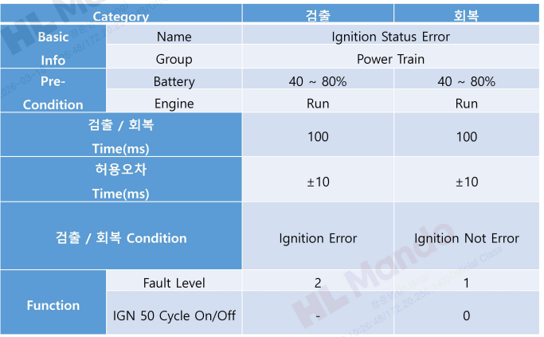
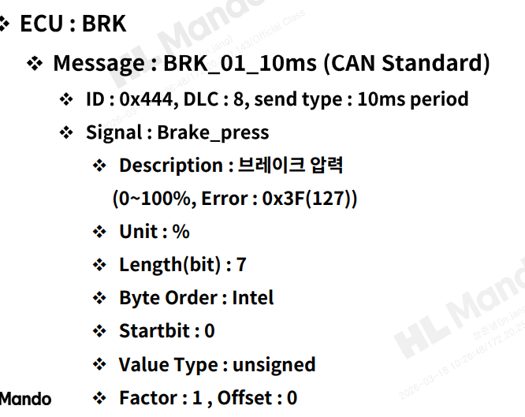
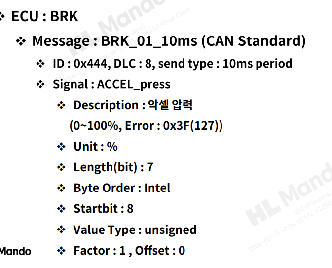
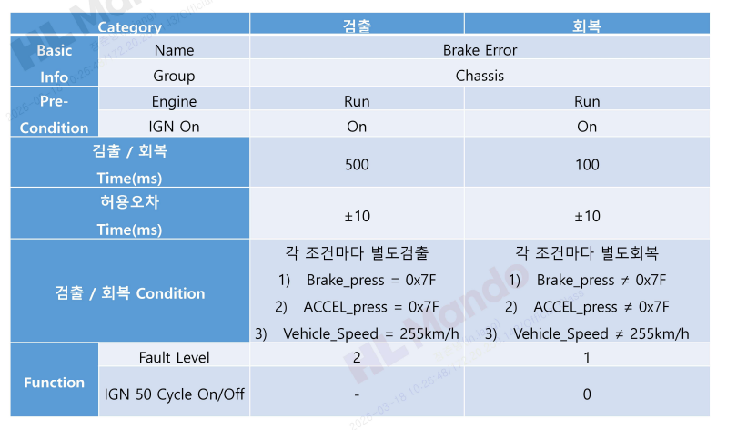
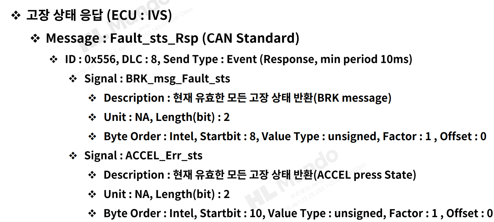

# Static Testing

## 1. Overview

본 문서는 IVS 제어기 Black Box Testing 프로젝트에서 수행한 **정적 테스팅(Static Testing)** 결과를 정리한 문서이다.

정적 테스팅은 실제 동작을 실행하기 전에 요구사항 문서, 메시지 정의, Signal Description, 값 표현 방식 등을 검토하여 명세 단계의 불일치와 설계 결함을 식별하는 활동이다.

본 프로젝트에서는 CANdb와 요구사항 문서를 비교하며 다음 항목을 중심으로 정적 검토를 수행했다.

- Signal length가 요구 상태 수를 충분히 표현할 수 있는지
- 값 표현 방식이 요구사항과 일치하는지
- Signal 명과 Description이 동일한 의미를 가지는지
- 앞선 정의가 뒤 페이지의 요구사항 사용 방식과 충돌하지 않는지

> 각 결함 항목에는 추적성을 위해 **근거가 된 페이지**와 **결함 또는 영향이 드러난 페이지**를 함께 표기했다.

---

## 2. Static Review Focus

정적 테스팅에서는 아래 관점을 중점적으로 확인했다.

### 2.1 Signal Length Consistency
Signal이 요구사항에 정의된 상태 수를 충분히 표현할 수 있는지 확인했다.

### 2.2 Value Representation Consistency
10진수와 16진수 표기, 상태값 표현 방식이 문서와 일치하는지 확인했다.

### 2.3 Signal Name / Description Consistency
Signal 이름과 Description이 같은 대상을 설명하는지 검토했다.

### 2.4 Traceability to Later Requirements
앞에서 정의된 Signal/값이 뒤 페이지에서 실제 요구사항에 사용될 때 충돌이 없는지 확인했다.

---

## 3. Static Defect List

본 프로젝트의 정적 테스팅에서는 총 4건의 결함을 식별했다.

1. `Ignition_sts` signal length mismatch
2. Value representation mismatch - Case 1
3. Value representation mismatch - Case 2
4. `Brake_Err_sts` Description mismatch

---

## 4. Static Defect Details

## 4.1 Defect 1 - Ignition_sts Signal Length Mismatch

### Traceability
- Source Document: `reports/defect_analysis.pdf`
- Requirement Reference: p.7
- Related Usage / Impact Reference: p.30

<table>
  <tr>
    <td align="center" width="50%">
       
      <b>Requirement Reference (p.7)</b>
    </td>
    <td align="center" width="50%">
       
      <b>Related Usage / Impact (p.30)</b>
    </td>
  </tr>
</table>

### Issue
`Ignition_sts`는 Description상 `Off / On / Error`의 3가지 상태를 표현해야 하지만, 메시지 정의에서는 1bit로 설정되어 있어 모든 상태를 표현할 수 없는 문제가 있었다.

### Why It Is a Defect
1bit는 최대 2가지 상태만 표현할 수 있으므로, 3가지 상태를 요구하는 Signal 정의와 충돌한다.

### Impact
이 문제는 단순 정의 오류가 아니라, 뒤 페이지에서 요구하는 `Ignition Error` 관련 검출 요구사항과 연결될 때 요구조건을 만족하지 못하게 만들 수 있다.

### Suggested Improvement
해당 Signal의 length를 최소 2bit로 수정해야 한다.

---

## 4.2 Defect 2 - Value Representation Mismatch (Case 1)

### Traceability
- Source Document: `reports/defect_analysis.pdf`
- Defect Reference: p.10
- Related Usage / Reference Page: p.32

<table>
  <tr>
    <td align="center" width="50%">
       
      <b>Defect Reference (p.10)</b>
    </td>
    <td align="center" width="50%">
       
      <b>Related Reference Page (p.32)</b>
    </td>
  </tr>
</table>

### Issue
요구사항과 비교했을 때 `127`과 `0x7f`의 표현이 일관되지 않게 사용된 부분이 있었다.

### Why It Is a Defect
`127`은 16진수로 `0x7f`와 같은 값이지만, 문서와 정의에서 표현 기준이 다르면 동일한 상태를 서로 다른 값처럼 해석할 가능성이 생긴다.

### Impact
- 테스트 기대값 정의가 흔들릴 수 있다.
- 구현과 검증이 서로 다른 기준으로 값을 해석할 수 있다.
- Error 상태 검증의 정확도가 떨어질 수 있다.

### Suggested Improvement
요구사항에서 명시한 기준에 맞춰 값을 `0x7f`로 일관되게 정리하는 것이 바람직하다.

---

## 4.3 Defect 3 - Value Representation Mismatch (Case 2)

### Traceability
- Source Document: `reports/defect_analysis.pdf`
- Defect Reference: p.11
- Related Usage / Reference Page: p.32

<table>
  <tr>
    <td align="center" width="50%">
       
      <b>Defect Reference (p.11)</b>
    </td>
    <td align="center" width="50%">
       
      <b>Related Reference Page (p.32)</b>
    </td>
  </tr>
</table>

### Issue
다른 항목에서도 동일하게 `127`과 `0x7f` 표현 불일치가 확인되었다.

### Why It Is a Defect
표현 방식이 일관되지 않으면, 테스트 설계와 요구사항 해석 과정에서 혼동이 발생한다.

### Impact
- 동일한 유형의 해석 오류가 여러 항목에서 반복될 수 있다.
- 단일 오타가 아니라 정의 방식 전반의 일관성 문제일 수 있다.
- 추후 유지보수 시 같은 유형의 오류를 반복할 위험이 있다.

### Suggested Improvement
해당 항목 역시 값 표현 기준을 `0x7f`로 통일해 문서와 정의의 일관성을 확보해야 한다.

---

## 4.4 Defect 4 - Brake_Err_sts Description Mismatch

### Traceability
- Source Document: `reports/defect_analysis.pdf`
- Correct Reference Page: p.18
- Defect Reference Page: p.19

<table>
  <tr>
    <td align="center" width="50%">
       
      <b>Correct Reference (p.18)</b>
    </td>
    <td align="center" width="50%">
       
      <b>Defect Reference (p.19)</b>
    </td>
  </tr>
</table>

### Issue
`Brake_Err_sts` Signal의 Description이 `Accel Press State`로 기재되어 있어 Signal 명과 설명이 서로 다른 의미를 가졌다.

### Why It Is a Defect
Signal 명은 Brake 관련 상태를 의미하는데 Description은 Accel Press State를 설명하고 있어, 문서상 의미가 충돌한다.

### Impact
- 테스트 설계 시 검증 대상을 잘못 해석할 수 있다.
- 구현 검토 및 결함 분석 과정에서 혼동이 발생할 수 있다.
- 문서 신뢰도와 추적성이 떨어진다.

### Suggested Improvement
해당 Description을 `Brake press state`로 수정하여 Signal 명과 같은 의미를 가지도록 정리해야 한다.

---

## 5. Connection to Dynamic Testing

정적 테스팅에서 확인한 결함은 이후 동적 테스팅 결과와도 연결될 수 있다.

대표적으로 `Ignition_sts`의 bit length 문제는 Ignition 관련 Fault가 요구조건대로 검출되지 않는 현상의 잠재 원인이 될 수 있다. 또한 값 표현 방식과 Description 불일치는 테스트 기대값 설정과 결과 해석의 정확도에 직접적인 영향을 줄 수 있다.

즉, 정적 테스팅은 단순 문서 검토가 아니라 동적 결함의 가능성을 사전에 드러내는 중요한 단계였다.

---

## 6. What I Learned from Static Testing

정적 테스팅을 수행하며 다음과 같은 점을 확인할 수 있었다.

- 요구사항 기반 검증에서는 문서와 정의 자체가 먼저 정확해야 한다.
- Signal length, 값 표현 방식, Description 불일치와 같은 문제는 실제 검출 로직과 테스트 정확도에 영향을 준다.
- 동적 테스팅 결과를 정확히 해석하려면, 정적 테스팅으로 전제 조건을 먼저 검토해야 한다.
- 테스트 엔지니어는 실행 결과뿐 아니라 정의 단계의 불일치도 식별할 수 있어야 한다.

---

## 7. Summary

본 프로젝트의 정적 테스팅에서는 다음과 같은 4건의 결함을 식별했다.

- `Ignition_sts`의 상태 수 대비 부족한 signal length
- `127`과 `0x7f` 간 값 표현 불일치 2건
- `Brake_Err_sts`와 Description 간 의미 불일치

이러한 결함은 단순 문서상의 문제가 아니라, 이후 동적 검증의 정확성과 Fault 로직 해석에 직접 영향을 줄 수 있는 요소였다.  
따라서 정적 테스팅은 본 프로젝트에서 동적 테스팅에 앞서 검증 기준을 정리하고 잠재 결함을 식별하는 중요한 단계였다.
