# Dynamic Testing

## 1. Overview

본 문서는 IVS 제어기 Black Box Testing 프로젝트에서 수행한 **동적 테스팅(Dynamic Testing)** 결과를 정리한 문서이다.

동적 테스팅은 실제 입력 조건을 구성하고, IVS의 Fault 검출/회복, 상태 전이, 삭제 조건, 타이밍 동작이 요구사항과 일치하는지 확인하는 활동이다.

본 프로젝트에서는 ECU 입력을 조합해 다양한 조건을 재현하고, Panel / Trace / 자동화 테스트 모듈을 활용하여 다음 항목을 중점적으로 검증했다.

- 경계값 조건
- Pre-condition 충족 여부
- Fault Detection / Recovery
- Deleted / Fixed / Faulted 상태 전이
- IGN Off → On 50 Cycle 삭제 조건
- 타이밍 조건

> 각 결함 항목에는 추적성을 위해 **근거가 된 요구사항 페이지**와 **실제 결함이 드러난 결과 이미지**를 함께 표기했다.

---

## 2. Dynamic Test Focus

동적 테스팅에서는 아래 관점을 중점적으로 검증했다.

### 2.1 Boundary Condition Validation
`15%`, `80%`, `20V`, `15V`, `50 Cycle`과 같은 경계값에서 요구사항과 실제 동작이 일치하는지 확인했다.

### 2.2 Pre-condition Validation
Fault가 특정 조건에서만 검출되어야 하는 경우, 입력 조합이 제대로 제한되는지 확인했다.

### 2.3 Detection / Recovery Validation
Fault가 요구된 조건과 시점에 검출되고, 회복 조건에서도 올바르게 상태가 전이되는지 확인했다.

### 2.4 Timing Validation
요구사항에 정의된 검출/회복 시간과 실제 동작 시점이 일치하는지 확인했다.

### 2.5 Testcase Reuse Strategy
기본적인 TESTCASE를 먼저 작성한 뒤, 각 페이지의 요구사양에 맞춰 함수와 파라미터를 수정하는 방식으로 테스트를 재사용했다.

---

## 3. Dynamic Defect List

본 프로젝트의 동적 테스팅에서는 다음과 같은 대표 결함을 확인했다.

1. Batt Percent 15% boundary miss-detection
2. IGN 50 Cycle off-by-one issue
3. Batt Percent 80% equality omission
4. Battery charging fault false detection under invalid pre-condition
5. Battery voltage high fault detection under invalid pre-condition
6. Battery voltage recovery threshold mismatch
7. Ignition fault level 2 miss-detection
8. Engine fault level 2 miss-detection
9. Brake / Accel / Vehicle independent fault miss-detection
10. Steering fault false detection under invalid condition
11. Steering fault timing error

---

## 4. Dynamic Defect Details

## 4.1 Defect 1 - Batt Percent 15% Boundary Miss-Detection

### Traceability
- Source Document: `reports/defect_analysis.pdf`
- Requirement / Defect Reference: p.27

<table>
  <tr>
    <td align="center" width="50%">
      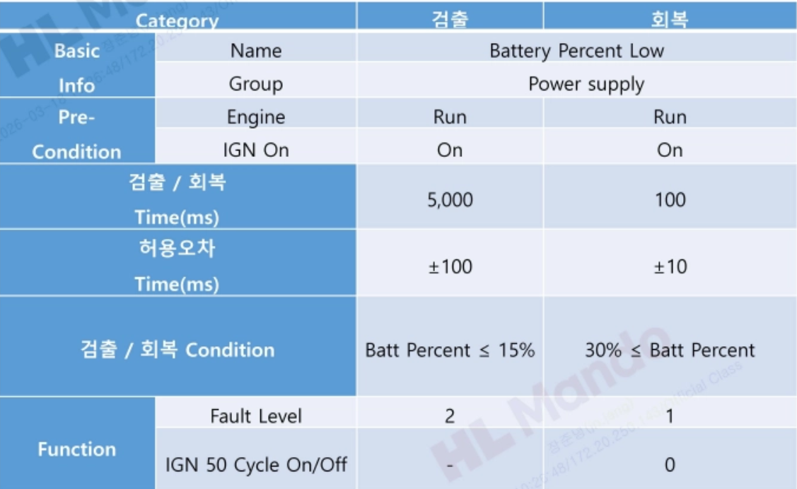 
      <b>Requirement Reference (p.27)</b>
    </td>
    <td align="center" width="50%">
       
      <b>Failure Evidence</b>
    </td>
  </tr>
</table>

### Test Condition
- IGN = 1
- ENG = 1
- Batt Percent = 15
- 측정 구간: 4900 ~ 5100ms

### Expected Behavior
Pre-condition 및 검출 조건 충족 시 Fault Level 2가 검출되어야 한다.

### Actual Result
`Batt Percent = 15%`에서만 Fault Level 2가 검출되지 않았다. 반면 15% 초과 구간에서는 정상적으로 검출되었다.

### Analysis
경계값 비교 연산에서 `<`와 `<=` 차이가 제대로 반영되지 않은 문제로 판단했다.

### Suggested Improvement
`Batt Percent ≤ 15%` 조건이 정확히 반영되도록 로직을 수정해야 한다.

---

## 4.2 Defect 2 - IGN 50 Cycle Off-by-One Issue

### Traceability
- Source Document: `reports/defect_analysis.pdf`
- Requirement / Defect Reference: p.27 ~ p.28

<table>
  <tr>
    <td align="center" width="50%">
       
      <b>Requirement Reference (p.27)</b>
    </td>
    <td align="center" width="50%">
      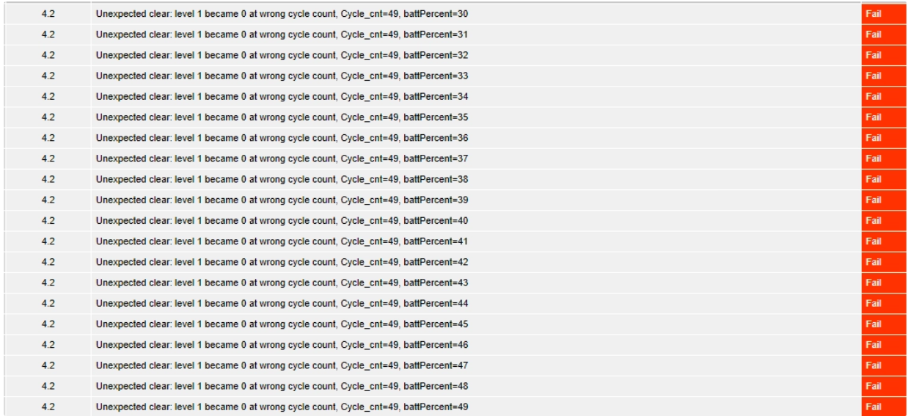 
      <b>Failure Evidence (p.28)</b>
    </td>
  </tr>
</table>

### Test Condition
- IGN Off → On 반복
- Batt Percent 전수조사

### Expected Behavior
IGN 50 Cycle에서만 Function이 동작해야 한다.

### Actual Result
실제 동작은 50회가 아닌 49회에서 발생했다.

### Analysis
카운트 조건이 하나 부족하게 설정된 전형적인 off-by-one 문제로 판단했다.

### Suggested Improvement
Function의 count 기준이 정확히 50에서 동작하도록 수정해야 한다.

---

## 4.3 Defect 3 - Batt Percent 80% Equality Omission

### Traceability
- Source Document: `reports/defect_analysis.pdf`
- Requirement / Defect Reference: p.28

<table>
  <tr>
    <td align="center" width="50%">
      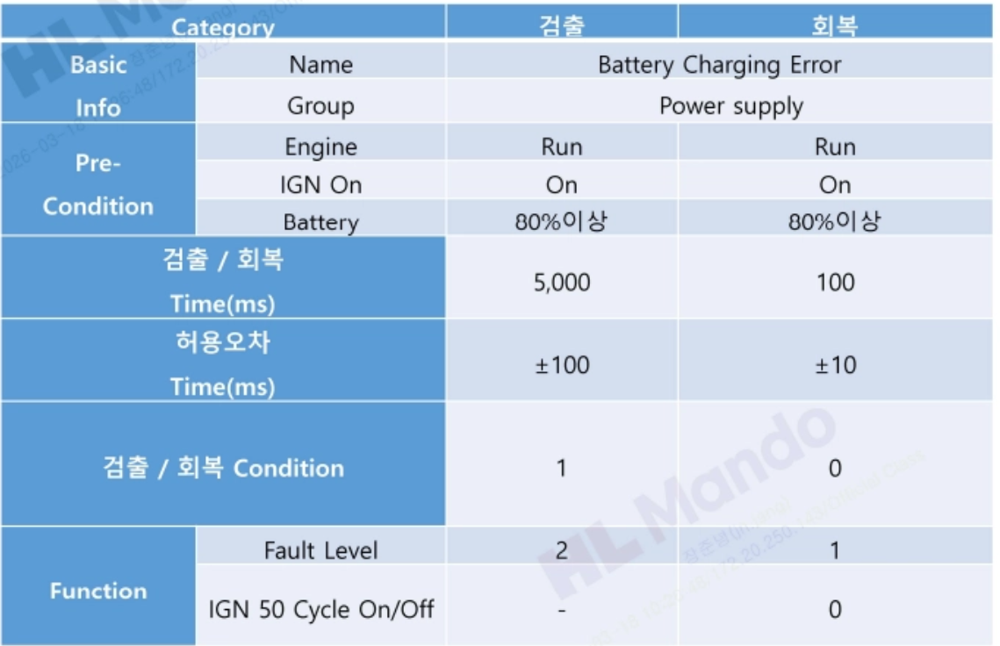 
      <b>Requirement Reference (p.28)</b>
    </td>
    <td align="center" width="50%">
       
      <b>Failure Evidence</b>
    </td>
  </tr>
</table>

### Test Condition
- IGN = 1
- Engine = 1
- Batt Percent = 80
- Chg_sts = 1

### Expected Behavior
Fault Level 2가 검출되어야 한다.

### Actual Result
`Batt Percent = 80%`에서만 검출되지 않았고, 80% 초과 구간에서는 정상적으로 검출되었다.

### Analysis
로직에서 `>= 80`이 아니라 `> 80`처럼 equality 조건이 누락된 것으로 판단했다.

### Suggested Improvement
경계값 `80% 이상` 조건이 정확히 반영되도록 수정해야 한다.

---

## 4.4 Defect 4 - Battery Charging Fault False Detection Under Invalid Pre-condition

### Traceability
- Source Document: `reports/defect_analysis.pdf`
- Requirement / Defect Reference: p.28

<table>
  <tr>
    <td align="center" width="50%">
       
      <b>Requirement Reference (p.28)</b>
    </td>
    <td align="center" width="50%">
      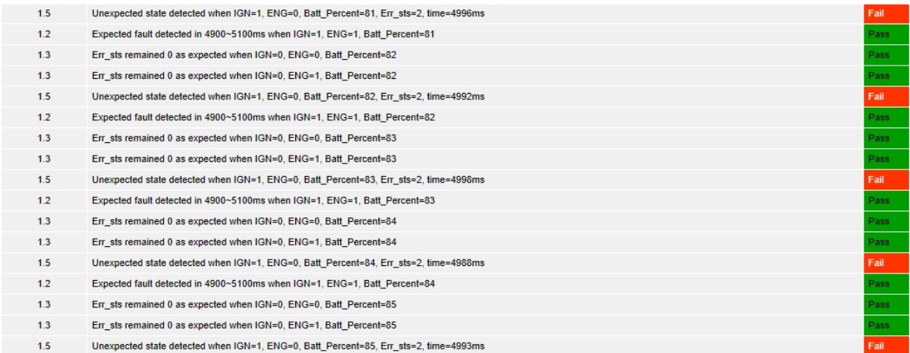 
      <b>Failure Evidence</b>
    </td>
  </tr>
</table>

### Test Condition
- IGN = 1
- Engine = 0
- Batt Percent > 80
- Chg_sts = 1

### Expected Behavior
해당 조건에서는 Fault Level 2가 **미검출**되어야 한다.

### Actual Result
Pre-condition이 맞지 않음에도 Fault Level 2가 검출되었다.

### Analysis
요구사항상 `IGN == 1 && Engine == 1` 조건에서만 검출되어야 하는데, Engine 조건이 누락된 것으로 판단했다.

### Suggested Improvement
Pre-condition을 정확히 반영해 `IGN == 1 && Engine == 1 && Batt Percent > 80 && Chg_sts == 1` 조건에서만 검출되도록 수정해야 한다.

---

## 4.5 Defect 5 - Battery Voltage High Fault Detection Under Invalid Pre-condition

### Traceability
- Source Document: `reports/defect_analysis.pdf`
- Requirement / Defect Reference: p.29

<table>
  <tr>
    <td align="center" width="50%">
      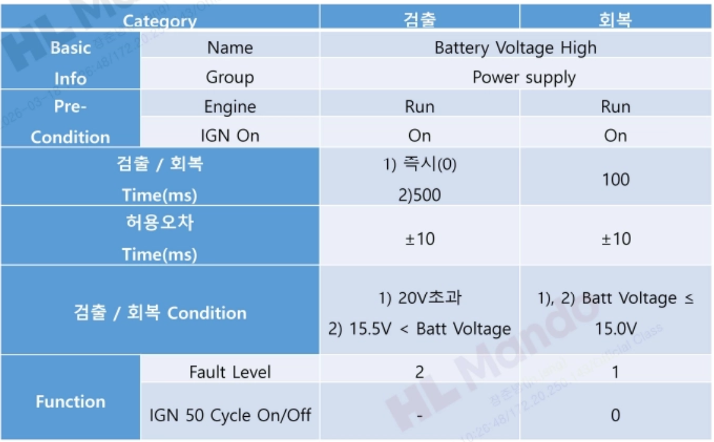 
      <b>Requirement Reference (p.29)</b>
    </td>
    <td align="center" width="50%">
      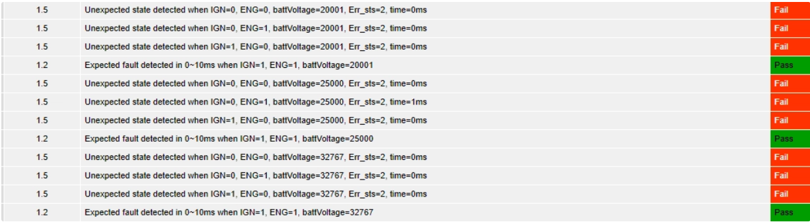 
      <b>Failure Evidence</b>
    </td>
  </tr>
</table>

### Test Condition
- IGN ≠ 1
- Engine ≠ 1
- Batt Voltage > 20V

### Expected Behavior
해당 조건에서는 Fault Level 2가 **미검출**되어야 한다.

### Actual Result
Pre-condition이 충족되지 않았음에도 Fault Level 2가 즉시 검출되었다.

### Analysis
요구사항상 `IGN == 1 && Engine == 1`인 경우에만 검출되어야 하는데, 조건 제한이 누락된 것으로 판단했다.

### Suggested Improvement
Batt Voltage High 검출은 `IGN == 1 && Engine == 1 && Batt Voltage > 20V` 조건에서만 발생하도록 수정해야 한다.

---

## 4.6 Defect 6 - Battery Voltage Recovery Threshold Mismatch

### Traceability
- Source Document: `reports/defect_analysis.pdf`
- Requirement / Defect Reference: p.29

<table>
  <tr>
    <td align="center" width="50%">
       
      <b>Requirement Reference (p.29)</b>
    </td>
    <td align="center" width="50%">
      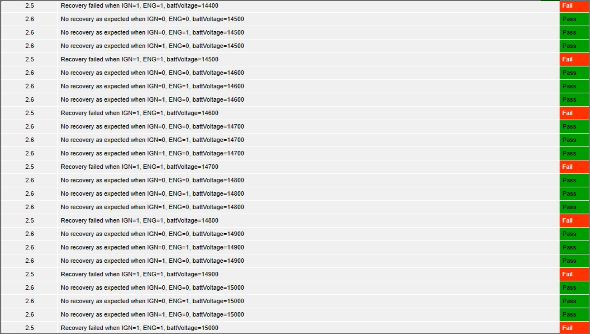 
      <b>Failure Evidence</b>
    </td>
  </tr>
</table>

### Test Condition
- IGN = 1
- Engine = 1
- Batt Voltage recovery 조건 확인

### Expected Behavior
`Batt Voltage ≤ 15V`에서 Fault Level 1으로 회복되어야 한다.

### Actual Result
실제 동작은 `Batt Voltage < 0.015V`에서만 회복되는 형태로 나타났다.

### Analysis
회복 기준값 또는 스케일 해석이 잘못 적용된 문제로 판단했다.

### Suggested Improvement
요구사항 기준인 `Batt Voltage ≤ 15V`로 회복 조건을 수정해야 한다.

---

## 4.7 Defect 7 - Ignition Fault Level 2 Miss-Detection

### Traceability
- Source Document: `reports/defect_analysis.pdf`
- Requirement / Defect Reference: p.30
- Related Static Issue: p.7 (`Ignition_sts` length)

<table>
  <tr>
    <td align="center" width="50%">
      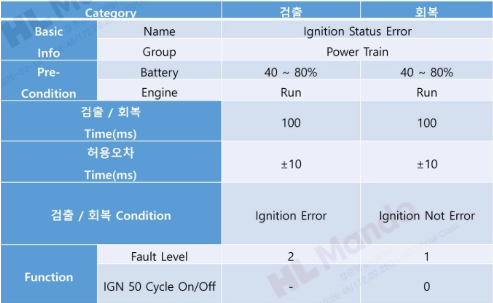 
      <b>Requirement Reference (p.30)</b>
    </td>
    <td align="center" width="50%">
      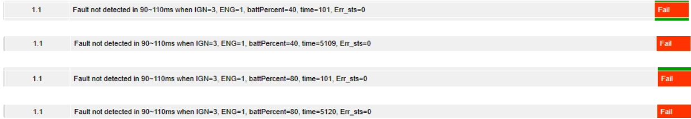 
      <b>Failure Evidence</b>
    </td>
  </tr>
</table>

### Test Condition
- Ignition_sts = 3
- 40 ≤ Batt Percent ≤ 80
- Engine_sts = 1

### Expected Behavior
Fault Level 2가 검출되어야 한다.

### Actual Result
5100ms까지 측정했으나 미검출되었다.

### Analysis
정적 테스팅에서 확인한 `Ignition_sts` signal length 문제와 연결 가능성이 있었으나, 테스트는 length 수정 후에도 미검출되어 검출 로직 자체의 결함으로 판단했다.

### Suggested Improvement
Ignition Fault 검출 로직을 요구조건에 맞게 재검토해야 한다.

---

## 4.8 Defect 8 - Engine Fault Level 2 Miss-Detection

### Traceability
- Source Document: `reports/defect_analysis.pdf`
- Requirement / Defect Reference: p.31

<table>
  <tr>
    <td align="center" width="50%">
      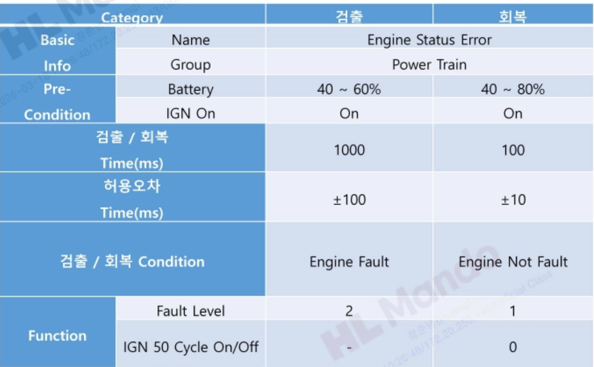 
      <b>Requirement Reference (p.31)</b>
    </td>
    <td align="center" width="50%">
      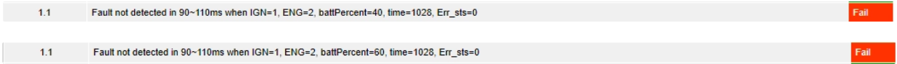 
      <b>Failure Evidence</b>
    </td>
  </tr>
</table>

### Test Condition
- Engine_sts = 2
- 40 ≤ Batt Percent ≤ 80
- IGN = 1
- 추가 확인: Engine_sts = 3

### Expected Behavior
Fault Level 2가 검출되어야 한다.

### Actual Result
5100ms까지 측정했으나 미검출되었고, Engine_sts = 3에서도 미검출이었다.

### Analysis
검출 조건 입력은 충족했으나 결과가 발생하지 않아, Engine 관련 검출 로직 결함으로 판단했다.

### Suggested Improvement
Engine 상태값에 대한 검출 로직과 상태 매핑을 재검토해야 한다.

---

## 4.9 Defect 9 - Brake / Accel / Vehicle Independent Fault Miss-Detection

### Traceability
- Source Document: `reports/defect_analysis.pdf`
- Requirement / Defect Reference: p.32

<table>
  <tr>
    <td align="center" width="50%">
      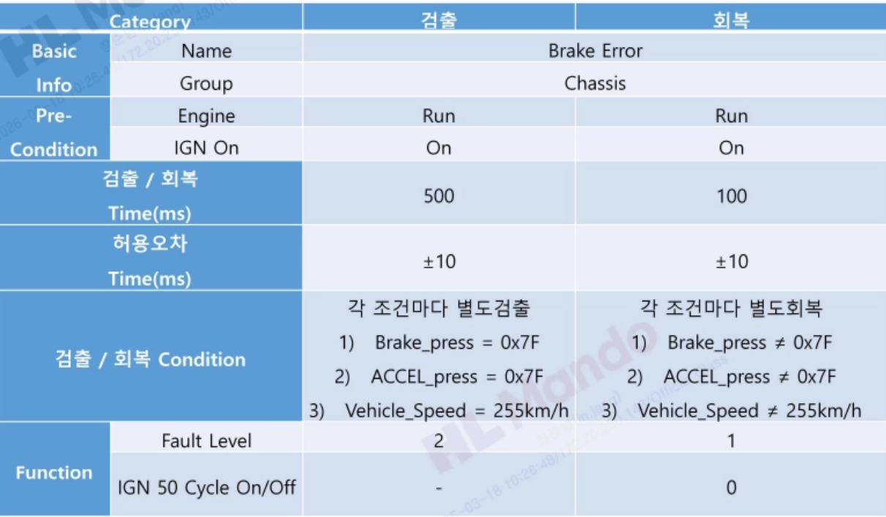 
      <b>Requirement Reference (p.32)</b>
    </td>
    <td align="center" width="50%">
       
      <b>Failure Evidence</b>
    </td>
  </tr>
</table>

### Test Condition
- Brake Press = 0x7F
- 또는 Accel_press = 0x7F
- 또는 Vehicle_Speed = 255

### Expected Behavior
독립 조건에서도 해당 Fault Level 2 검출이 가능해야 한다.

### Actual Result
각 조건에서 독립적으로 검출되지 않았다.

### Analysis
브레이크 / 악셀 / 차량속도 관련 Error 조건이 OR 조건이 아니라 잘못 묶였거나, 개별 검출 경로가 구현되지 않은 것으로 판단했다.

### Suggested Improvement
각 입력 조건이 요구사항에 맞게 독립적으로 Fault 검출에 반영되도록 로직을 수정해야 한다.

---

## 4.10 Defect 10 - Steering Fault False Detection Under Invalid Condition

### Traceability
- Source Document: `reports/defect_analysis.pdf`
- Requirement / Defect Reference: p.33

<table>
  <tr>
    <td align="center" width="50%">
      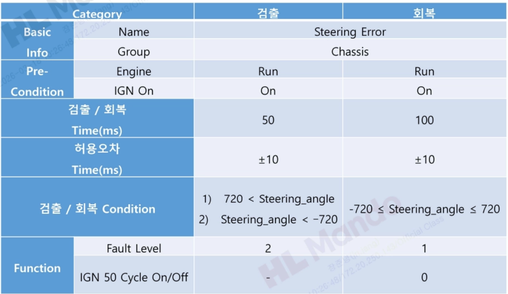 
      <b>Requirement Reference (p.33)</b>
    </td>
    <td align="center" width="50%">
      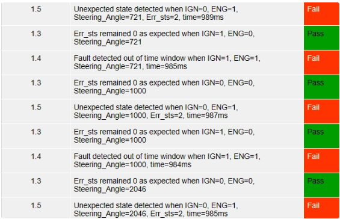 
      <b>Failure Evidence</b>
    </td>
  </tr>
</table>

### Test Condition
- Steering_Angle > 720 또는 Steering_Angle < -720
- Engine = 1
- Ignition = 0
- 측정 시점: 1000ms ±10ms

### Expected Behavior
해당 조건에서는 Fault Level 2가 **미검출**되어야 한다.

### Actual Result
Fault Level 2가 검출되었다.

### Analysis
Ignition 조건이 맞지 않는데도 검출된 것으로 보아, Steering Fault 로직에서 Pre-condition 반영이 누락된 것으로 판단했다.

### Suggested Improvement
요구사항 p.33에 맞게 Ignition 조건을 정확히 반영해 미검출이 되도록 수정해야 한다.

---

## 4.11 Defect 11 - Steering Fault Timing Error

### Traceability
- Source Document: `reports/defect_analysis.pdf`
- Requirement / Defect Reference: p.33

<table>
  <tr>
    <td align="center" width="50%">
       
      <b>Requirement Reference (p.33)</b>
    </td>
    <td align="center" width="50%">
      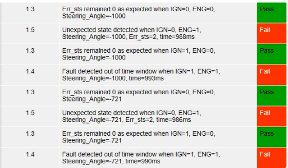 
      <b>Failure Evidence</b>
    </td>
  </tr>
</table>

### Test Condition
- Steering_Err_sts 관련 검출 시점 확인

### Expected Behavior
요구사항상 `50 ± 10ms`에서 검출되어야 한다.

### Actual Result
실제 검출 시점은 약 `1000 ± 10ms` 수준이었다.

### Analysis
Fault 자체는 발생했지만, 요구사항에서 정의한 검출 타이밍을 크게 벗어나 타이밍 로직 결함으로 판단했다.

### Suggested Improvement
요구사항 p.33에 맞게 검출 시점을 `50 ± 10ms`로 수정해야 한다.

---

## 5. What Dynamic Testing Showed

동적 테스팅 결과, 결함은 단순히 “검출된다 / 안 된다” 수준이 아니라 아래 유형으로 구분되었다.

- 경계값에서만 실패하는 결함
- 카운트 조건이 1 차이 나는 off-by-one 결함
- Pre-condition 미반영으로 인한 오검출
- Recovery 조건의 기준값 불일치
- 요구조건 입력을 만족해도 검출되지 않는 miss-detection
- 검출은 되지만 시점이 맞지 않는 timing defect

이러한 결과는 요구사항 기반 검증에서 **입력 조합**, **상태 전이**, **시간 조건**, **경계값 해석**이 모두 중요하다는 점을 보여준다.

---

## 6. What I Learned from Dynamic Testing

동적 테스팅을 수행하며 다음과 같은 점을 확인할 수 있었다.

- 경계값 결함은 직전 값 / 해당 값 / 초과 값을 함께 비교해야 정확히 드러난다.
- Fault 검출 여부뿐 아니라, 어떤 조건에서 검출되어야 하는지와 언제 검출되어야 하는지를 함께 확인해야 한다.
- 요구사항 기반 테스트는 단일 조건 검증보다 상태 조합과 타이밍 검증이 더 중요할 수 있다.
- 테스트 결과는 단순 PASS/FAIL 정리보다, 왜 실패했는지 원인을 논리적으로 연결하는 것이 중요하다.

---

## 7. Summary

본 프로젝트의 동적 테스팅에서는 다음과 같은 대표 결함을 확인했다.

- `Batt Percent = 15%` 경계값 미검출
- `IGN 50 Cycle`이 49회에서 동작하는 off-by-one 문제
- `Batt Percent = 80%` equality 조건 누락
- Pre-condition 미반영으로 인한 Battery Charging / Battery Voltage / Steering 오검출
- Battery Voltage recovery 기준 불일치
- Ignition / Engine / Brake / Steering 관련 miss-detection
- Steering timing error

이러한 결과를 통해, 요구사항 기반 동적 검증은 단순 기능 확인이 아니라  
**경계값, 상태 조합, 조건 충족 여부, 검출 시점**까지 함께 검토해야 한다는 점을 확인할 수 있었다.
